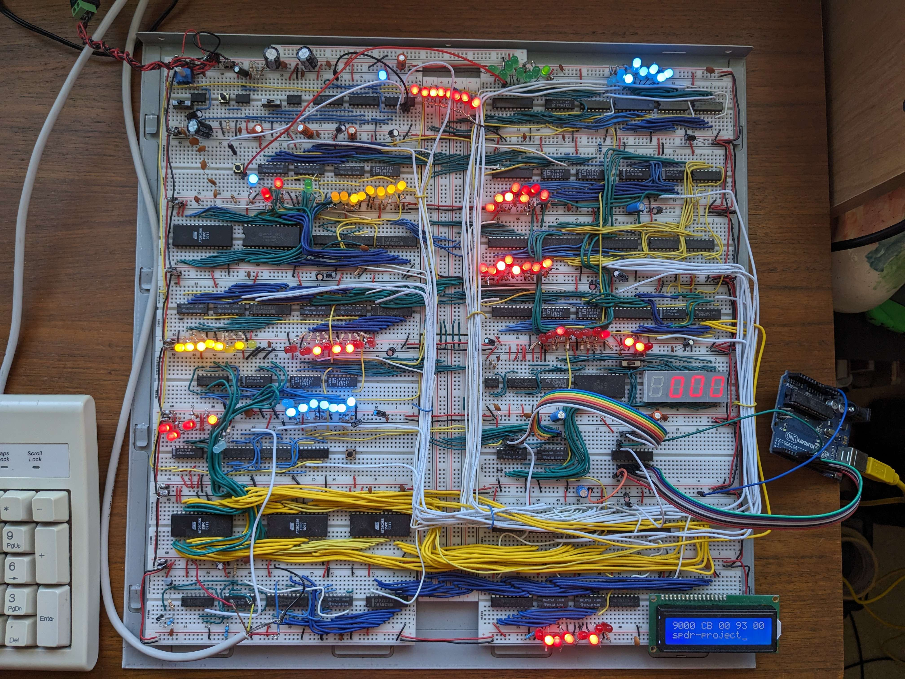

# SPDR
The SPDR project is an 8-bit TTL CPU build on breadboards.
It based on [Ben Eaters 8-bit CPU](https://eater.net/8bit) but greatly extended.

## Repos
The SPDR project is made up of several smaller projects.
- [Assembler](https://github.com/Sockyman/aspdr)
- [Previous assembler](https://github.com/Sockyman/spas)
- [Compiler](https://github.com/Sockyman/bspdr)
- [Instruction Set Library](https://github.com/Sockyman/spdr-firmware)
- [Software (Assembly)](https://github.com/Sockyman/spdr-software-asm)

## Features
- 64KiB of addressable memory (32K RAM, 32K ROM)
- 3 multipurpose 8-bit registers
- 256 byte stack
- 107 instructions
- ALU provided by a [74ls181](https://en.wikipedia.org/wiki/74181)
- Right shift and right rotate instruction
- Interupts
- [PS/2](https://en.wikipedia.org/wiki/PS/2_port) keyboard interface
- [HD44780](https://en.wikipedia.org/wiki/Hitachi_HD44780_LCD_controller) lcd interface

## Software
- [Monitor program](https://github.com/Sockyman/spdr-software-asm/blob/main/kernel.spdr)
- [Calculator](https://github.com/Sockyman/spdr-software-asm/blob/main/calculator.spdr)
- Snake

## Pictures

